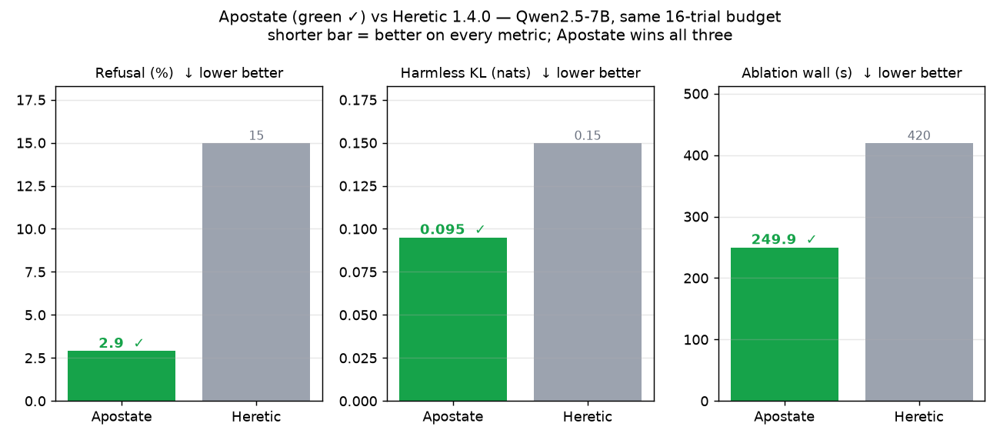
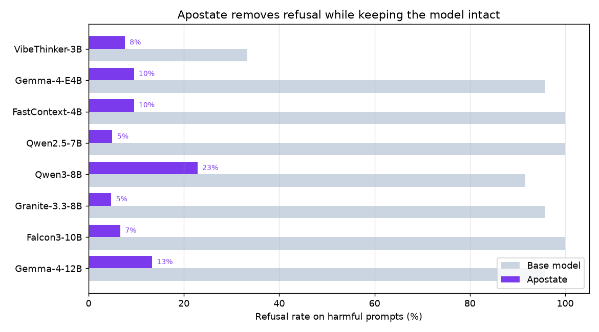
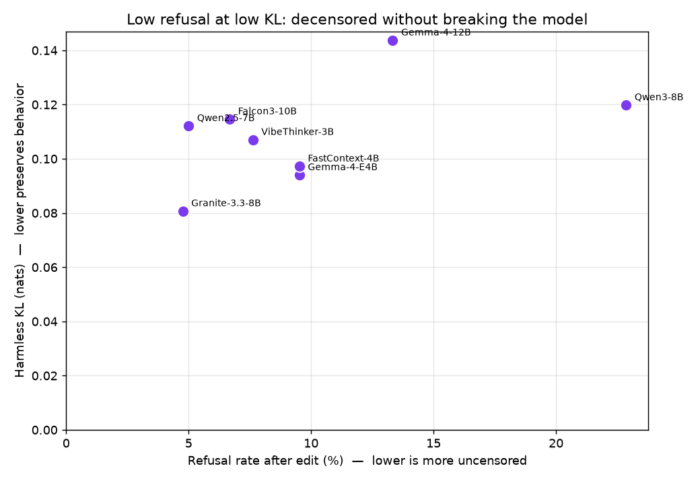
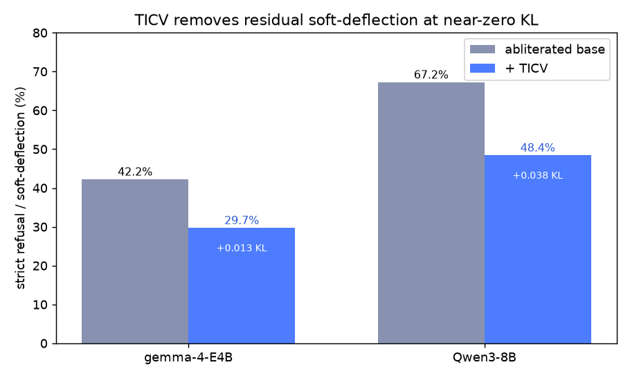

[](https://discord.gg/JR6hMmJNuB)

# Apostate

**Uncensor any instruction-tuned LLM by editing its weights, with no finetuning, no jailbreak prompts, and near-zero quality loss.** The output is a normal Transformers checkpoint that drops in anywhere the base model works, except it stops refusing.

## What is Apostate?

Instruction-tuned models are trained to refuse certain requests. Apostate finds the exact direction inside the network responsible for that refusal reflex and permanently removes it from the weights. Nothing else about the model changes.

No runtime hook. No adapter. No finetune. No jailbreak prompt. You get a standard checkpoint (safetensors, or GGUF) that behaves like the original but answers instead of refusing.

## Install

```bash
git clone https://github.com/heterodoxin/apostate.git
cd apostate
pip install -e .
apostate setup
```

`apostate setup` installs the Python dependencies, CUDA Torch from the PyTorch `cu128` wheel index on NVIDIA systems, and checks GPU visibility. To install the dependencies by hand instead:

```bash
python -m pip install --index-url https://download.pytorch.org/whl/cu128 torch torchvision torchaudio
python -m pip install transformers accelerate datasets safetensors optuna bitsandbytes textual
```

The TUI is pure Python (Textual), so there is no Node dependency.

### AMD / ROCm

`apostate setup` detects an AMD GPU (it looks for `/dev/kfd`) and offers the ROCm path, which installs a ROCm build of Torch that bundles its own ROCm runtime. To install by hand instead:

```bash
python -m pip install --index-url https://download.pytorch.org/whl/rocm6.4 torch torchvision torchaudio
python -m pip install transformers accelerate datasets safetensors optuna textual
```

RDNA4 cards (Radeon RX 9000 series, R9700, `gfx1201`) need ROCm 6.4 or newer. If `apostate doctor` reports the GPU cannot run a kernel, the Torch wheel's bundled runtime is too old for your card: install the system ROCm stack from AMD and retry.

- Linux install guide: https://rocm.docs.amd.com/projects/install-on-linux/en/latest/
- Packaged installer: `amdgpu-install --usecase=rocm` (RDNA4 needs ROCm 6.4+; use a newer Torch wheel index such as `rocm6.4` to match).
- Verify with `rocminfo` (it should list your `gfx` target), then run `apostate doctor`.

bitsandbytes 4-bit is CUDA-first, so on ROCm apostate runs bf16 by default; a 24GB+ card handles models up to about 14B comfortably. For ROCm 4-bit, install a ROCm build of bitsandbytes manually.

Always run `apostate doctor` after install. It executes a real GPU kernel and catches an RDNA4/gfx12xx-on-old-ROCm mismatch before any large model load.

## Why it's better

Abliteration itself is not new. The popular tool for it is **Heretic**, and Apostate beats it head-to-head. Same model, same 16-trial budget, same seed:

| model | refusal | kl | ablation wall |
|---|---:|---:|---:|
| Qwen2.5-7B base | 95.8% | 0.000 | n/a |
| **Apostate** | **2.9%** | **0.095** | **249.9s** |
| Heretic 1.4.0 | 15.0% | 0.150 | 420s |



- **Lower on every axis, and faster.** Apostate lands at 2.9% refusal and KL 0.095 in ~250s. Heretic's best point at the same budget is 15% refusal at KL 0.150 in ~420s. Less refusal, less collateral damage, about 1.7x quicker.
- **A better operator.** Apostate removes refusal along a *contrastive co-vector* that keeps the harmless behavior entangled with it, so the model stays sharp instead of turning into a yes-machine. That is where the low KL comes from.
- **Broader coverage.** Dense and MoE, pre-norm and post-norm (Gemma), including 30-50B packed-MoE on a single 34GB card. Tools built around one architecture do not reach these.
- **A real weight edit, not a finetune or a jailbreak.** No forgetting, no style drift, no prompt to paste, nothing that breaks on the next update. It bakes into a standard checkpoint that drops into Transformers, vLLM, llama.cpp/GGUF, Ollama, and LM Studio.

## Why should I care?

- You want a model that **answers the question** instead of lecturing you or dodging with "I can't help with that."
- You're doing **red-teaming or safety research** and need a model that won't refuse your test set.
- You want the base model's **full capability without the corporate guardrails**, without the intelligence tax that finetuned "uncensored" models charge.
- You're writing fiction, exploring edgy topics, or building an assistant that treats you like an adult.
- It runs **anywhere**: a bf16 checkpoint for Transformers/vLLM, or a GGUF quant for llama.cpp / Ollama / LM Studio.

> ⚠️ Apostate models are **uncensored**. They will answer harmful and dangerous requests. You are responsible for how you use them.

## Downloads

All under [huggingface.co/heterodoxin](https://huggingface.co/heterodoxin), baked bf16 Transformers checkpoints (drop-in for the base model).

| model | base | arch |
|---|---|---|
| [qwen3.6-27b-apostate](https://huggingface.co/heterodoxin/qwen3.6-27b-apostate) ([GGUF Q5_K_M](https://huggingface.co/heterodoxin/qwen3.6-27b-apostate-gguf)) | Qwen3.6-27B | MoE |
| [gemma-4-12b-it-apostate](https://huggingface.co/heterodoxin/gemma-4-12b-it-apostate) | Gemma-4-12B | post-norm |
| [gemma-4-e4b-it-apostate](https://huggingface.co/heterodoxin/gemma-4-e4b-it-apostate) | Gemma-4-E4B | post-norm |
| [granite-3.3-8b-instruct-apostate](https://huggingface.co/heterodoxin/granite-3.3-8b-instruct-apostate) | Granite-3.3-8B | dense (scaled) |
| [falcon3-10b-instruct-apostate](https://huggingface.co/heterodoxin/falcon3-10b-instruct-apostate) | Falcon3-10B | dense |
| [vibethinker-3b-apostate](https://huggingface.co/heterodoxin/vibethinker-3b-apostate) | VibeThinker-3B | dense |
| [fastcontext-1.0-4b-sft-apostate](https://huggingface.co/heterodoxin/fastcontext-1.0-4b-sft-apostate) | FastContext-1.0-4B | dense |
| [qwen3-8b-apostate](https://huggingface.co/heterodoxin/qwen3-8b-apostate) | Qwen3-8B | dense |
| [qwen2.5-7b-instruct-apostate](https://huggingface.co/heterodoxin/qwen2.5-7b-instruct-apostate) | Qwen2.5-7B | dense |

## Results

Across the published roster, Apostate takes models from near-total refusal to single-digit / low refusal, while keeping the change to harmless behavior (KL) small:





**Qwen3.6-27B** (MoE): R9700, 4-bit NF4, JBB refusal `n=48`, KL over 48 harmless prompts.

| model | refusal | complied | kl |
|---|---:|---:|---:|
| base | 95.8% | 4.2% | 0.000 |
| apostate | 8.3% | 87.5% | 0.159 |

**Gemma-4-12B** (post-norm): reader-side path with the contrastive co-vector, R9700, 4-bit NF4, KL capped at 0.15.

| model | refusal | complied | kl |
|---|---:|---:|---:|
| base | 95.8% | 4.2% | 0.000 |
| apostate | 13.3% | 86.7% | 0.144 |

**Gemma-4-E4B** (post-norm, multimodal): R9700, 4-bit NF4.

| model | refusal | complied | kl |
|---|---:|---:|---:|
| base | 95.8% | 4.2% | 0.000 |
| apostate | 36.0% | 64.0% | 0.119 |

This checkpoint also ships **TICV** (Topic-Invariant Co-Vectors), a light second edit that strips residual *soft deflection*: engaging non-answers that dodge the request ("bomb is a broad term, which kind?") instead of complying. Scored by a strict deflection-catching judge on JailbreakBench, TICV cuts refusal from 42.2% to 29.7% for just **+0.013 KL**, and it generalizes across architectures: on Qwen3-8B it cuts 67.2% to 48.4% at +0.038 KL.



---

# For researchers

Everything below is the technical detail: the algorithm, the operator math, the CLI, and per-architecture handling.

## How it works

Apostate collects harmful and harmless activations from the base model. It forms a low-rank basis from the harmful-minus-harmless mean and treats that basis as the first refusal axis. When `multi_refusal=true`, it also searches for independent refusal axes from harmful clusters, harmful clusters against nearest harmless clusters, high-residual harmful tails, and residual SVD axes. Each new axis has to survive harmful/harmless separation and harmful-coverage filters before it is fused into the subspace. The optimizer can still choose rank 1 when extra axes cost too much KL.

Layer strength is measured instead of guessed. The runner temporarily ablates one layer at a time, records how much refusal behavior moves, and uses that response curve as the alpha prior. The search then scores direction layer, rank, layer band, strength, causal mix, causal sharpness, embedding strength, and head strength when the architecture supports it.

Balanced mode targets low refusal first, then pulls KL back down with global alpha scaling and layer trimming. Repair passes add corrective directions only when they improve the refusal/KL tradeoff. Capability drift is penalized with canonical-answer logprob probes on small math and code items, then checked again with public benchmarks.

The projection itself is oblique, not symmetric. A plain `I - R R^T` removal shifts the harmless residual mean along the refusal direction, and that mean shift is the dominant source of KL. Apostate instead removes `R` along a co-vector `U = R` minus its harmless-mean component, so the projector `E = I - Rbake U^T` still zeroes `R` (`E R = 0`) but leaves the harmless mean untouched (`E mu = mu`). The mean-shift KL term collapses while harmful inputs are still fully ablated. It is weight-only with no bias, so it bakes into bias-free checkpoints like Qwen2.5, and because it is a fixed linear map it composes correctly across MoE router gates. `oblique_strength` interpolates between symmetric (`0`) and full mean-preservation (`1`); the co-vector is clamped when `R` aligns too closely with the harmless mean.

`--oblique-predictive` goes one step further. Instead of the fixed mean-orthogonal co-vector it fits a per-layer ridge predictor `W` of the harmless `R`-projection from the rest of the activation and removes along `D = R - W`. The harmless `R`-projection is largely predictable from the other features, so `D·x` is near zero on harmless inputs and the harmless *variance* along `R` is preserved, not just the mean; the harmful refusal excursion is out-of-distribution for `W` and is still removed in full (`E R = 0`). This lowers the bf16 edit KL below the mean co-vector. The advantage is largest in full precision (NF4 requantization narrows it back toward the plain oblique), so it is most useful when the checkpoint is served in bf16.

The predictor is **contrastive** by default (`oblique_contrast=1`). `W` is fit to reproduce the harmless `R`-projection while being explicitly penalized for firing on the harmful set: `W = (AᵀA + γ·CᵀC + λI)⁻¹ Aᵀb`, with `A` the harmless and `C` the harmful activations, both orthogonalized to `R`. This keeps the harmless-*specific* variance along `R` but drops the variance shared with the harmful set, the component that, on architectures with residual/embedding scaling multipliers (e.g. Granite's `embedding_multiplier`/`residual_multiplier`/`logits_scaling`), smuggles refusal back in under plain mean-preserving oblique. It took Granite-3.3-8B from a stuck ~69% to ~5% refusal and improved Qwen on both refusal and KL, so it is the default for both the writer (oblique) and reader paths.

Models that store MoE experts as **packed 3D tensors** (`qwen3.5-moe`, `granitemoehybrid`, `diffusion_gemma`) are not quantizable by bitsandbytes, which only replaces `nn.Linear`. Apostate quantizes those experts expert-by-expert to NF4 and routes the experts forward through a Triton WMMA dequant-matmul, so a 30-50B packed-MoE fits a single 34GB card; the VRAM preflight accounts for this and refuses cleanly when a model genuinely will not fit.

The main optimization target combines classifier-judged refusal rate, a weak-response guard, harmless-token KL, penalty above `kl_target`, penalty above `max_kl`, and cheap capability drift. The weak-response guard is used during optimization so short answers, deflections, safety lectures, and generic overviews do not count as solved harmful prompts. Public benchmark refusal scoring uses `protectai/distilroberta-base-rejection-v1` by default and reports weak/noncompliance rates separately. Keyword refusal scoring remains available with `--judge keyword`.

## Soft-deflection removal (TICV)

Abliteration removes hard refusals, but a model can still *soft-deflect*: engaging non-answers that dodge the request without ever refusing ("bomb is a broad term, which kind did you mean?"). A strict deflection-catching judge counts these as failures, and they survive the refusal edit because they are not refusals. TICV (Topic-Invariant Co-Vectors) is a light second edit that removes them.

The direction is built from the model's *own* behavior, not a harmful/harmless topic split. On a set of harmful prompts the abliterated model already produces a mix of deflections and real deliveries; a strict judge labels each, and `R = mean(deflect) - mean(deliver)` is the residual-space deflection axis. It is topic-matched (the same prompts appear on both sides) so it captures deflection, not topic, the confound that a plain harmful-minus-harmless direction carries. The detector `D` is the same predictive co-vector as the refusal path, but its preserve set is seeded with benign hedging and caveats ("is it safe to...", "what are the risks of..."), so `D·x` reads near zero on normal disclaimers and only fires on evasive deflection. That is what keeps the added KL near zero: the edit is invisible to legitimate hedging.

TICV bakes into standard weights with no runtime hooks. Per layer it repurposes one MLP neuron as a **constant-gate writer**: the gate row is aimed at a near-constant activation dimension so its gelu output is an approximately fixed scalar `c`, the up row is set to `D`, and the down column is set to `-a·R/c`, so the neuron adds `-a·(x·D)·R` to the residual exactly where deflection is detected. It is weight-only, bias-free, and rank-1 per layer, so it composes with the abliteration edit and exports to GGUF unchanged. On gemma-4-E4B it cuts strict refusal 42.2% to 29.7% for +0.013 KL, and the same recipe on Qwen3-8B (a pre-norm arch) cuts 67.2% to 48.4% at +0.038 KL, so the mechanism is not architecture-specific.

## Ablate

```bash
apostate ablate --model Qwen/Qwen2.5-7B-Instruct --out qwen-apostate
apostate ablate --model Qwen/Qwen2.5-7B-Instruct --out qwen-apostate --resume
```

`--model` takes a Hugging Face repo id **or a local directory**. For a local model, point it at the model folder (the directory that holds `config.json`), not an individual `.safetensors` file. `--out` is the directory the edited checkpoint is written to.

`--resume` reuses activation cache files after an interrupted run. A finished run writes `report.json`, `report.md`, `apostate_config.json`, a checkpoint `README.md`, and any `activation_cache/*.pt` files used by resume.

Balanced defaults are `target_refusal=0.0`, `kl_target=0.04`, `max_kl=0.12`, `kl_positions=8`, `preserve_rank=8`, `max_rank=3`, `multi_refusal=true`, `multi_refusal_min_coverage=0.05`, `refine_deescalate=true`, `refine_kl_steps=10`, `refine_kl_layer_steps=10`, `repair_steps=4`, and `oblique_ablation=true`. The hard cap is `max_kl`; `kl_target` is the pressure point used during search. Set `--oblique-ablation false` to fall back to the symmetric projection. Add `--oblique-predictive` to use the predictive co-vector (lower bf16 KL; see above), paired with a small nonzero `--target-refusal` such as `0.05` since its strength is at moderate refusal.

## Benchmark

The benchmark path is built into the TUI. Open `apostate`, choose `Test`, pick the edited model and base model, then use the suite selector. Space toggles a suite and Enter runs the selected set.

Suites are `humaneval`, `mbpp`, `gsm8k`, `refusal`, or `all`. DeepSWE is not listed.

Benchmark output is written to `benchcode.json` and `benchcode.md`. If the candidate directory has an Apostate `report.json`, the benchmark result is merged into the candidate report and model card.

## Chat

```bash
apostate talk --model qwen-apostate --quant nf4
apostate talk --model qwen-apostate --backend vllm --kv-cache-dtype turboquant_4bit_nc
```

`--quant` controls local weight loading: `auto`, `bf16`, `fp16`, `nf4`, `fp4`, `int8`, `gptq`, `marlin`, or `awq`. `--kv-cache-dtype` is only for vLLM KV cache dtype. TurboQuant belongs there, not in weight quantization.

On Windows, vLLM runs through WSL. Apostate stops the WSL vLLM server when chat exits unless `APOSTATE_KEEP_WSL=1` or `--no-shutdown-wsl` is set.

## Model Selection

The TUI has separate model lists for ablation and chat/test. Ablation scans Hugging Face cache plus local checkpoints and hides Apostate variants. Chat/test scans local disks for Apostate checkpoints, including folders that do not start with `apostate`, while ignoring HF cache entries.

Use `APOSTATE_MODEL_ROOTS` to add scan roots. Values are separated with the platform path delimiter.

## Data

Default fit data combines `mlabonne/harmful_behaviors` train prompts, `mlabonne/harmless_alpaca` train prompts, and local prompt files under `data/`. Held-out eval uses `mlabonne/harmful_behaviors` test, JailbreakBench behaviors, `mlabonne/harmless_alpaca` test, and the local refusal calibration set. Balanced mode front-loads 64 refusal calibration prompts and 48 public harmless KL prompts into validation so the optimizer sees the same hard refusal and KL distribution used by the public report path.

Custom data specs use `repo:split:col`, `repo@config:split:col`, or several sources joined with `|`. Local text files are accepted.

## Model Coverage

Model support is detected from module layout. Current coverage includes Llama 2/3, Qwen2/2.5/3/3.5(-MoE), Mistral, Mixtral, DeepSeek, Gemma/Gemma2/Gemma 4 text decoders including `google/gemma-4-E4B` and `gemma-4-12B`, Granite 3 and `granitemoehybrid` (Mamba-2 hybrid MoE), Phi-3/Phi-4, GPT-NeoX, Pythia, OPT-style decoder stacks, and MPT-style block stacks. Non-CausalLM archs (multimodal / block-diffusion such as `diffusion_gemma`) load through the appropriate `AutoModel*` class. Packed-MoE experts are NF4-quantized so 30-50B MoEs fit a 34GB card.

Multimodal wrapper models are supported for the text path when Transformers exposes a causal language decoder inside the model object. Image and audio pipelines are not edited yet.

Gemma 2/3/4 use a post-norm sandwich, so editing writer outputs gets renormalized away. Apostate detects this and switches to reader-side ablation: it projects the per-layer refusal direction out of the inputs of the modules that read the residual, mainly MLP gate/up paths and the per-layer input gate. Attention q/k/v is skipped because it added attention drift without reliable refusal gain. The edit still bakes cleanly into a standalone checkpoint. Gemma 4 E4B goes from about 96% to 36% refusal this way, coherent and complying, at a higher KL than dense pre-norm models; a light TICV pass (see Results) then strips residual soft-deflection at near-zero added KL.

The reader edit uses the same contrastive co-vector as the writer path: `x' = x − a·(x·D)·R` removes refusal along `R` while re-injecting the harmless-predictable component, instead of the plain `x − a·(x·R)·R`. Per-layer strength is chosen at the refusal/KL knee (`min(refusal + w·kl)` under the budget) rather than the strongest setting under budget, which overshoots. With both, Gemma-4-12B goes from ~88% to **13% refusal at KL 0.14** (versus ~29%/0.47 for the plain reader). For packed-MoE post-norm models the experts are NF4-quantized and the co-vector is applied to the residual feeding them.

## Requirements

Use Python 3.10+, CUDA Torch, Transformers, Accelerate, Datasets, Safetensors, Optuna, BitsAndBytes, Textual, and enough VRAM for the selected model. A 7B NF4 run expects about 16 GB VRAM. `accelerate` is required for `device_map` loading; `apostate setup` installs it, but add it yourself if you install the dependencies by hand.

## Acknowledgements

Thanks to the people who have helped make Apostate better:

- **dreamfast** for benchmarking Apostate (the head-to-head numbers above) and adding Docker support.
- **erm14254** for the packed-MoE expert compatibility shim.
- **MelodicRecognition7** for detailed setup feedback: the missing `accelerate` dependency note, how to point at a local model, and the TUI / quantization edge cases.
